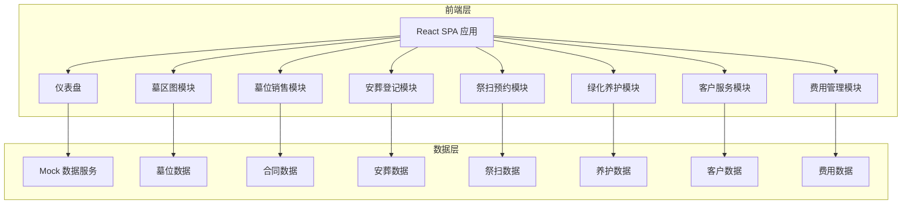
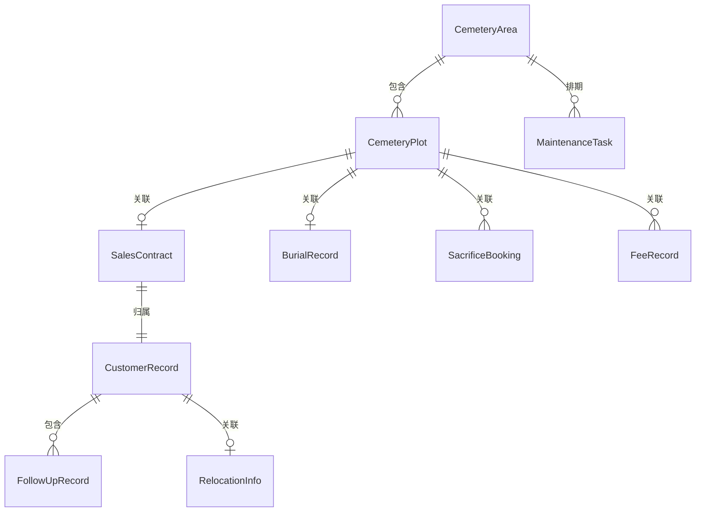

## 1. 架构设计



## 2. 技术说明

- 前端：React@18 + TypeScript + Tailwind CSS@3 + Vite
- 初始化工具：Vite (react-ts模板)
- 后端：无（纯前端应用，使用Mock数据）
- 数据库：无（本地Mock数据 + localStorage持久化）
- 状态管理：React Context + useReducer
- 路由：React Router v6
- 图表：Recharts
- 日期处理：date-fns
- 图标：Lucide React
- 动画：CSS Transitions + Framer Motion

## 3. 路由定义

| 路由 | 用途 |
|------|------|
| / | 仪表盘 - 数据概览与今日待办 |
| /cemetery-map | 墓区图 - 电子墓区分布图与墓位状态 |
| /plot-sales | 墓位销售 - 购墓合同登记与管理 |
| /burial-registration | 安葬登记 - 安葬预约与立碑刻字 |
| /sacrifice-booking | 祭扫预约 - 祭扫分流与代客祭扫 |
| /green-maintenance | 绿化养护 - 养护排期与任务管理 |
| /customer-service | 客户服务 - 迁墓处理与回访档案 |
| /fee-management | 费用管理 - 续缴提醒与账单管理 |

## 4. API定义

本项目为纯前端应用，使用Mock数据服务。数据接口定义如下：

### 4.1 墓位相关

```typescript
interface CemeteryPlot {
  id: string;
  areaId: string;
  areaName: string;
  row: number;
  column: number;
  position: string;
  status: 'available' | 'reserved' | 'sold' | 'buried' | 'maintenance';
  type: 'single' | 'double' | 'family';
  price: number;
  orientation: string;
  area: number;
  holderName?: string;
  deceasedName?: string;
  contractId?: string;
  saleDate?: string;
  burialDate?: string;
}
```

### 4.2 合同相关

```typescript
interface SalesContract {
  id: string;
  contractNo: string;
  plotId: string;
  plotPosition: string;
  buyerName: string;
  buyerPhone: string;
  buyerIdCard: string;
  deceasedName?: string;
  price: number;
  paymentMethod: 'full' | 'installment';
  paidAmount: number;
  status: 'pending' | 'signed' | 'completed' | 'cancelled';
  signingDate: string;
  notes?: string;
}
```

### 4.3 安葬相关

```typescript
interface BurialRecord {
  id: string;
  plotId: string;
  plotPosition: string;
  deceasedName: string;
  deceasedIdCard?: string;
  deathDate: string;
  burialDate: string;
  burialTimeSlot: string;
  status: 'scheduled' | 'preparing' | 'in_progress' | 'completed';
  inscription?: InscriptionInfo;
}

interface InscriptionInfo {
  content: string;
  fontStyle: 'regular' | 'bold' | 'traditional';
  specialRequests?: string;
  designUrl?: string;
  status: 'pending' | 'confirmed' | 'engraved';
}
```

### 4.4 祭扫相关

```typescript
interface SacrificeBooking {
  id: string;
  plotId: string;
  plotPosition: string;
  visitorName: string;
  visitorPhone: string;
  visitDate: string;
  timeSlot: string;
  visitorCount: number;
  type: 'self' | 'proxy';
  proxyService?: ProxyServiceInfo;
  status: 'pending' | 'confirmed' | 'completed' | 'cancelled';
}

interface ProxyServiceInfo {
  serviceType: 'basic' | 'standard' | 'premium';
  flowerRequired: boolean;
  incenseRequired: boolean;
  specialRequests?: string;
  feedbackPhotos?: string[];
  feedbackVideo?: string;
}
```

### 4.5 养护相关

```typescript
interface MaintenanceTask {
  id: string;
  areaId: string;
  areaName: string;
  type: 'greening' | 'cleaning' | 'repair' | 'inspection';
  scheduledDate: string;
  assignee: string;
  status: 'pending' | 'in_progress' | 'completed';
  description: string;
  photos?: string[];
  completedDate?: string;
}
```

### 4.6 客户相关

```typescript
interface CustomerRecord {
  id: string;
  buyerName: string;
  buyerPhone: string;
  plotId: string;
  plotPosition: string;
  contractNo: string;
  lastVisitDate?: string;
  nextFollowUpDate?: string;
  followUpRecords: FollowUpRecord[];
  relocationRequest?: RelocationInfo;
}

interface FollowUpRecord {
  id: string;
  date: string;
  type: 'phone' | 'visit' | 'wechat';
  content: string;
  satisfaction?: number;
}

interface RelocationInfo {
  type: 'relocate_out' | 'relocate_in';
  fromPlot?: string;
  toPlot?: string;
  reason: string;
  status: 'pending' | 'approved' | 'in_progress' | 'completed';
  fee: number;
}
```

### 4.7 费用相关

```typescript
interface FeeRecord {
  id: string;
  plotId: string;
  plotPosition: string;
  contractNo: string;
  feeType: 'management' | 'maintenance' | 'burial' | 'inscription' | 'relocation';
  amount: number;
  dueDate: string;
  paidDate?: string;
  paidAmount: number;
  status: 'unpaid' | 'partial' | 'paid' | 'overdue';
  reminderSent: boolean;
}
```

## 5. 服务器架构图

本项目为纯前端应用，无后端服务器。数据通过Mock服务提供，状态通过React Context管理。

## 6. 数据模型

### 6.1 数据模型定义



### 6.2 数据定义

数据通过TypeScript接口定义在Mock数据文件中，使用localStorage进行持久化存储，应用启动时初始化默认数据。
